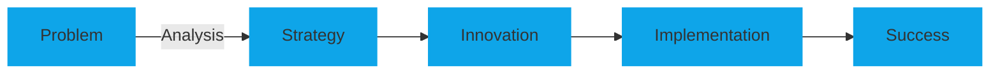

# 

  
  
  
  

## 🚀 About Me

> "Building the future, one line at a time."

I'm the founder of **UPSICAST**, where we don't just write code – we architect digital experiences that inspire. With expertise in full-stack development and UI/UX design, I transform complex problems into elegant, user-centered solutions.

  
  
  

## 💻 Tech Stack

  
  ### Frontend
  
  
  
  
  
  
  
  
  ### Backend
  
  
  
  
  
  
  ### Tools & Platforms
  
  
  
  
  

## 🎯 Services

| 🎨 **UI/UX Design** | 🚀 **Development** | 🤖 **AI & Automation** | ☁️ **Infrastructure** |
|:-------------------:|:------------------:|:---------------------:|:---------------------:|
| Responsive Design   | Full Stack Apps    | Custom AI Models      | Cloud Architecture    |
| User Research       | SaaS Solutions     | Process Automation    | Security Setup        |
| Prototyping         | API Integration    | ML Implementation     | Server Management     |
| Design Systems      | PWA Development    | Data Analytics        | DevOps               |

## 🔥 Featured Projects

  
  
  
    
    
  

## 💭 Our Philosophy

At UPSICAST, we believe in a systematic approach to solving complex problems:

> *"In the world of technology, the only constant is change. We don't just adapt – we lead it."*

## 📫 Let's Connect

  
  
  
  
  
💬 Interested in working together? Let's create something amazing!

  

---

  

