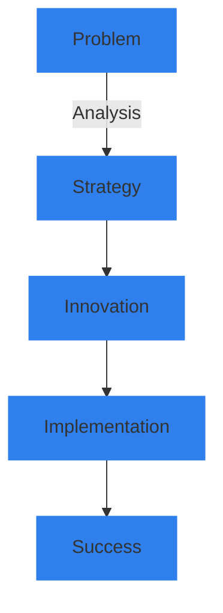

<!-- Animated Banner -->

<!-- Animated Typing -->

<!-- Social Links with Animations -->

  &nbsp;
  

<!-- Animated Stats -->

  
  

<!-- About Me Section with Custom Styling -->

<h2>🚀 About UPSICAST</h2>

 

*We don't just write code – we architect digital experiences that inspire.*

<!-- Tech Stack Section -->

<h2>⚡ Technical Arsenal</h2>

 

<!-- Frontend -->
<h3>Frontend Development</h3>

  

<!-- Backend -->
<h3>Backend Development</h3>

  

<!-- Tools & Platforms -->
<h3>Tools & Platforms</h3>

  

<!-- Services Section -->

<h2>🎯 Our Services</h2>

 

| 🎨 UI/UX Design | 🚀 Development | 🤖 AI & Automation | ☁️ Infrastructure |
|:---------------:|:--------------:|:-----------------:|:-----------------:|
| Responsive Design | Full Stack Apps | Custom AI Models | Cloud Architecture |
| User Research | SaaS Solutions | Process Automation | Security Setup |
| Prototyping | API Integration | ML Implementation | Server Management |
| Design Systems | PWA Development | Data Analytics | DevOps |

<!-- Current Projects -->

<h2>🔥 Featured Projects</h2>

 

  
  

<!-- Philosophy Section -->

<h2>💭 Our Philosophy</h2>

 

> *"In the world of technology, the only constant is change. We don't just adapt – we lead it."*

<!-- Contact Section -->

<h2>📫 Let's Connect</h2>

 

  

<!-- Footer -->

